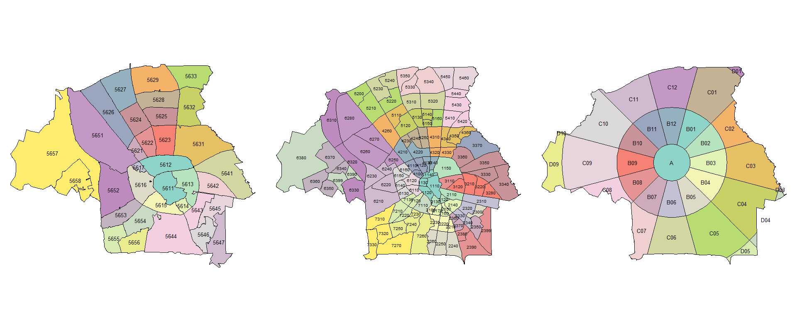
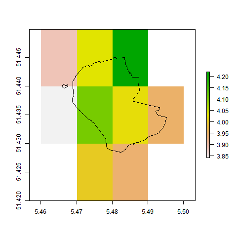
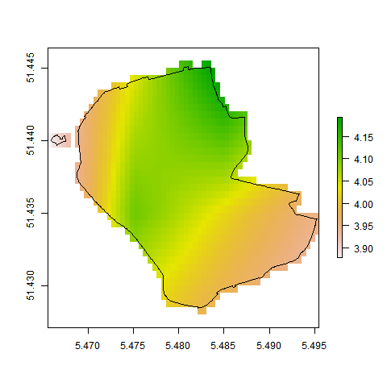

```{r setup, include=FALSE} 
## uses package https://github.com/odeleongt/postr
knitr::opts_chunk$set(warning = FALSE, message = FALSE) 

library(tidyverse)
library(here)
library(hrbrthemes)
library(patchwork)

##TNO colours
#B2CDDF
#7FADC9
#578CAB
#42667A
#E5087D pink
#F6F6F6 white

#devtools::install_github("odeleongt/postr")

```

## Header row {data-height=7}

###

<table style="width:100%">
<tr>
  <td><center><h3>
  **System for estimating mortality from air pollution using high resolution population and concentration data**
  </h3></center></td>
  <td rowspan="2">
  </img>
  </td>
</tr>
<tr><td><center>
  **Blaise Kelly** &nbsp;
  <i class="fas fa-envelope"></i> blaise.kelly\@tno.nl &nbsp;
  <i class="fas fa-globe"></i> <a href="https://tno.nl" style="text-decoration:none;">tno.nl</a> &nbsp;
  </center></td>
</tr>
</table> 

<hr>

## Body row {data-height=30}

### **Introduction** {data-width=400}

**How can data on population and local mortality be combined with high spatial and temporal resolution PM~2.5~ concentration data to provide more context on risk and potentially cumulative effects on mortality?**

**Being able to ascribe risk and mortality to concentrations of pollutants such as PM~2.5~ can help improve the relevance of concentrations to the public and enable researchers to better understand impacts.**


### **Spatial area** {data-width=800}

Postcode level 4 (PC4), 'Neighbourhood' and the 'Clockboard' were considered.

```{r, areas, error=FALSE, warning=FALSE, fig.pos="bottom"}
par(mar = c(4, 4, .1, .1))


```

### **Inputs to the model** {data-width=400}

```{r, diagram, echo=FALSE, warning = FALSE}

library(DiagrammeR)
library(DiagrammeRsvg)
library(rsvg)
library(magrittr)

##TNO colours
#B2CDDF
#7FADC9
#578CAB
#42667A
#E5087D pink
#F6F6F6 white

external_data <- '#42667A' 
sub_data <- '#578CAB'
pp_data <- 'WhiteSmoke'
calcz <- '#E5087D'
outz <-  '#B2CDDF' 
unk <- 'DeepSkyBlue'


g <- grViz("digraph {
      graph [layout = dot]
      
      node [shape = rectangle, style = filled, fontcolor = '#F6F6F6', fontname = 'Franklin Gothic Medium', fontsize = 8]
      A [label = 'RR\n IER Curve', fillcolor = '@@1']
      B [label = 'Mortality\n Total', fillcolor = '@@1']
      D [label = 'Population', fillcolor = '@@1']
      E [label = 'Concentration\n PM2.5', fillcolor = '@@1']
      F [label = 'RR\n PM2.5', fillcolor = '@@1']
      H [label = 'Fankte Model', fillcolor = '@@4', shape = diamond]
      L [label = 'Mortality\n PM2.5', fillcolor = '@@2']
      
      
      # edge definitions with the node IDs
      edge [labelfontname = 'Arial']
      
      {A D E} -> F
      {F B} -> H
      H -> L
     
      
      
      
      
}
      
      [1]: external_data
      [2]: sub_data
      [3]: pp_data
      [4]: calcz
      [5]: outz
      [6]: unk
      
      ",
height = 200)
g

```

## Footer row {data-height=50} 

### Concentrations {data-width=40}
Hourly PM~2.5~ concentration data at a 1km x 1km resolution is estimated using the LOTOS EUROS chemistry transport model. The concentrations from this model were assimilated with ground based measurement sites, including the Innovative Air Measurement System (ILM) in Eindhoven. It uses a Local Ensemble Transform Kalman Filter (EnKF) to reduce the bias error.

The original output from the LE model for Postcode area 5611 is shown on the left and disaggregated by a factor of 20 using the 'bilinear' method from the R Raster package function 'disaggregate'.

```{r, eval=TRUE, fig.show="hold", out.width="50%", echo=FALSE, warning=FALSE}

library(spData)
library(raster)

par(mar = c(4, 4, .1, .1))




```

This provides hourly concentration estimates at 1km spatial resolution, both in real-time and historically. It is also planned to assign 'labels' to pollutants from particular emission sources to the model. This will allow source apportionment of the final concentrations, enabling mortality impacts to be ascribed to sources and potentially allowing differentiation between different types of PM based on chemical composition and potential of causing health damage.

### Mortality Data {data-width=15}
Three datasets were combined together 1. all Annual Deaths grouped by Sex, Age and all ICD10 codes, 2. Weekly totals grouped by Sex and Age, but not split by disease and 3. regional deaths also split by Sex, Age and ICD10 code for each year (regions with data in figure on right).

The following five categories of disease are considered: 

 -ischemic heart disease (IHD)  
 -stroke  
 -chronic obstructive pulmonary disease (COPD)  
 -lung cancer in adults (LC)  
 -acute lower respiratory infections (ALRI) in children.

### Region specific data {data-width=25}
```{r, GM_plots, echo=FALSE,out.height="50%", error=FALSE, warning=FALSE, message=FALSE}

library(tmap)
library(sf)

GM <- st_read("plots/shps/WijkBuurtkaart_2021_v1/gemeente_2021_v1.shp", quiet=TRUE)

#tm2 <- tm_shape(GM) + tm_polygons("GM_CODE", legend.show = F, border.col = "black", lwd = 0.1) +
 # tm_text("GM_CODE", size = 1/5) + tm_layout(frame = FALSE, outer.margins = c(0.01, 0.01,0.01,0.01))

weekly_mort <- readRDS("data/weekly_regio_mort.RDS")

all_GM <- st_union(GM)

GM_in <- filter(GM, GM_CODE %in% weekly_mort$Region)

tm3 <- tm_shape(all_GM) + tm_polygons(alpha = 0) + tm_shape(GM_in) + tm_polygons("GM_CODE", legend.show = F, border.col = "black", lwd = 0.1) + tm_text("GM_CODE", size = 1/5) + tm_layout(frame = FALSE, outer.margins = c(0.01, 0.01,0.01,0.01))

tm3
# 
# #tmap_arrange(tm2, tm3, nrow = 1)
# tmap_save(tm2, "../../../plots/tm2.png")
# tmap_save(tm3, "../../../plots/tm3.png")

#par(mar = c(4, 4, .1, .1))

#knitr::include_graphics('../../../plots/tm2.png')
#knitr::include_graphics('../../../plots/tm3.png')

```

## Footer row {data-height=30} 

### Population {data-width=20}
Zicht Op Data and Resono are able to provide estimates from mobile smart phones of approximately 13% of the Dutch population for the number of persons in any pre defined 'area' using a propriety algorithm called 'hyperfencing'. This is combined with a cluster analysis that applies a machine learning algorithm to determine the probability that a device being carried by a user is inside or outside this 'hyperfence' and how long they have been there for, The chart below illustrates the number of people in PC4 area 5611 at a specific time step and duration.

### Population {data-width=20}
```{r, pop_plots, eval=TRUE, fig.show='hold', echo=FALSE, warning=FALSE, message=FALSE}

library(waffle)

zt_mort <- readRDS("data/zt_mort.RDS") 

## define row number
rn <- 20
tot <- sum(zt_mort[rn,c(4:10)])
pc <- zt_mort[rn,1]
t <- zt_mort[rn,2]
time_spent <- c('0-30'= zt_mort[rn,4], '30-60'=zt_mort[rn,5], '1-2'=zt_mort[rn,6], '2-4'=zt_mort[rn,7], 
                '4-8'=zt_mort[rn,8], '8-16'=zt_mort[rn,9], '16+' = zt_mort[rn,10])

waffle(time_spent, rows = round(tot/30), title = paste0("Time spent in ", pc, " at time ", t))


``` 

### GBD and Fankte {data-width=40}
Since 2010 the IHME GBD study has produced an IER curve that can be used to estimate the relative risk from PM~2.5~ and the associated mortality. Fankte et el built on this to apply it at regional level. This work has looked at how this can be combined with the data availabe in the Eindhoven region of the Netherlands.

The relative risk (RR) factor is calculated from the coefficients and $C_0$ taken from the GBD 2015 study, concentration data (C) from the chemistry transport model  

$RR_{C \ge C_0} = 1+a*(1-(exp(-(B*(C-C0)^d)))))$

Cities that have a concentration less than $C_0$ are given a RR of 1  
$RR_{C < C_0} = 1$

Mortality due to $PM~2.5~  is calculated using RR and M_ij from input data  
$M_{ij}^{PM_{2.5}} = (RR-1)/RR*M_{ij})$


## Footer row {data-height=20} 

### Conclusion {data-width=25}
This work is investigating how high temporal and spatial resolution concentration and population data can be combined with mortality data to determine the risk to populations and estimate the mortality due to air pollution.

Future work, also comparing the IHME model with other methods for ascribing mortality and including PM~2.5~ type e.g. sea salt etc.

### Credits {data-width=65}
Acknowledgement is made to Zicht Op Data and Resono who have provided the population data
for this study.

#### The team
**Blaise Kelly** specialises in air quality modelling and geospatial analysis.
**Dr. Bas Henzing** is an expert in atmospheric composition, aerosol  and satellite observations and air quality modelling.
**Ioanna Skoulidou** is studying for a PhD in Atmospheric Physics at the University of Thessaloniki.
**Dr. Robert Jansen** is a senior researcher at Marble Market and specialises in research design, data visualisation and analytics, advanced statistical analysis, monitoring and evaluation studies.
**Dr. Janot Tokaya** has a background in physics. For the past two years he has moved to the realm of air quality modelling and focuses on improving aerosol modelling using satellite and ground based observations.
**Dr. Mara Hauck** specialises in the LCA of energy options, chemical risk assessment modelling and uncertainty assessment.


<!--
### My Website {data-width=10 .small}

<td rowspan="0"></center>
  </img>
</center></td>

-->

